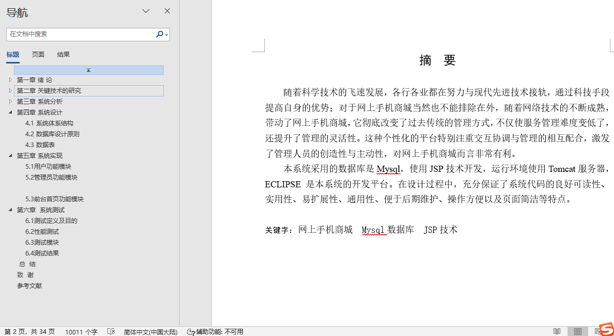
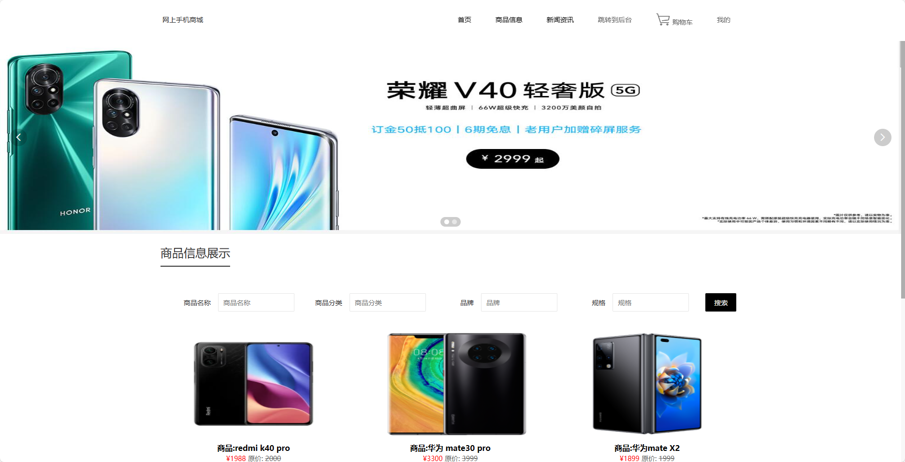
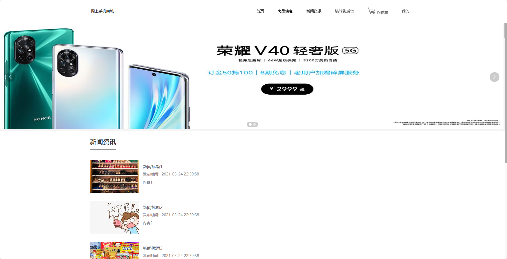
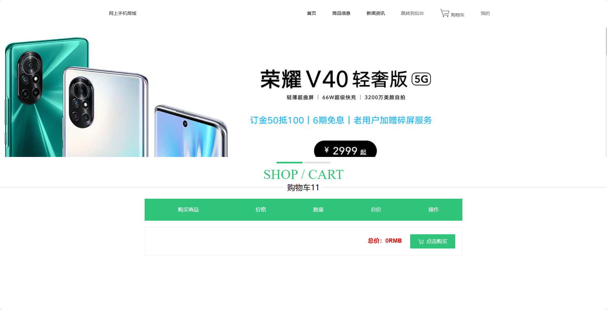
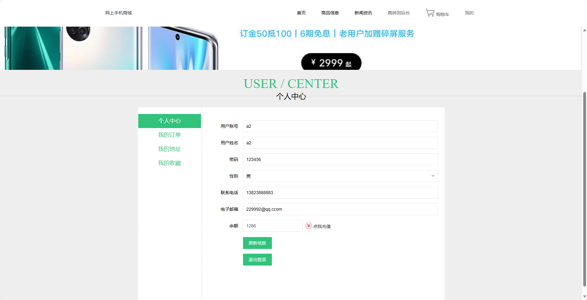
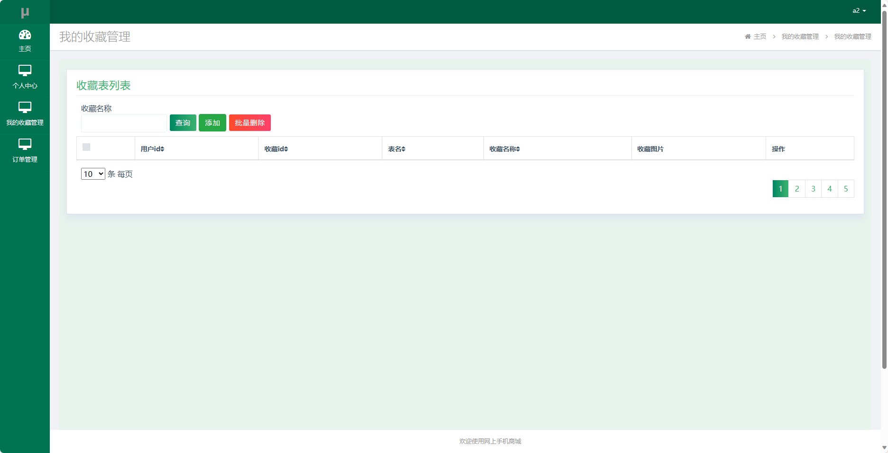
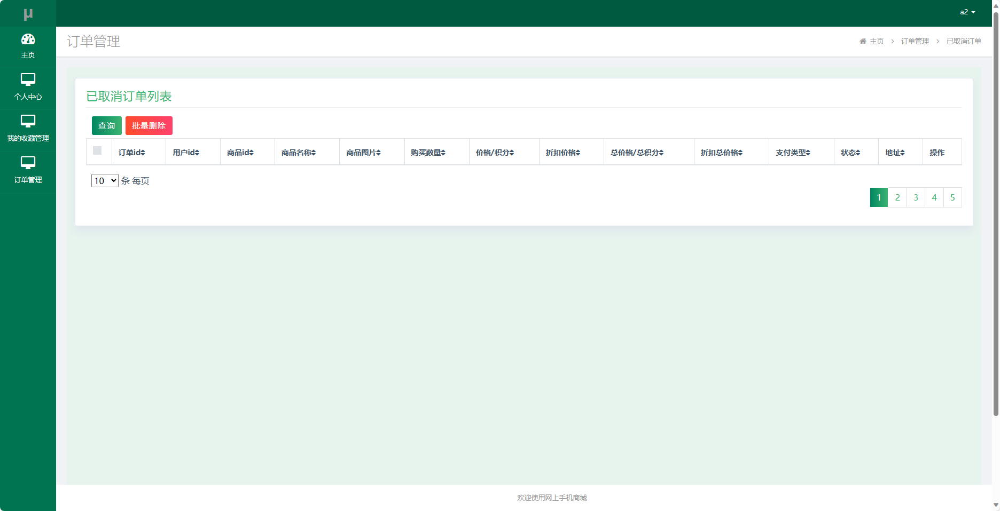
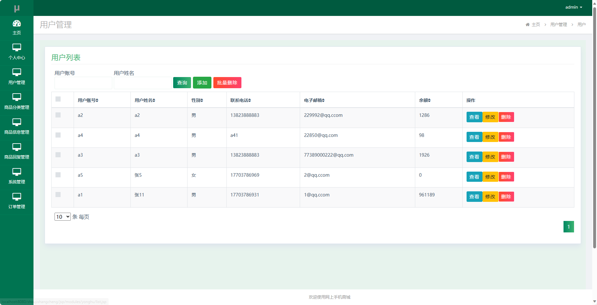
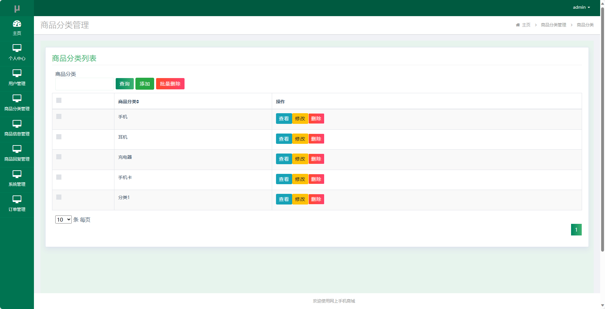
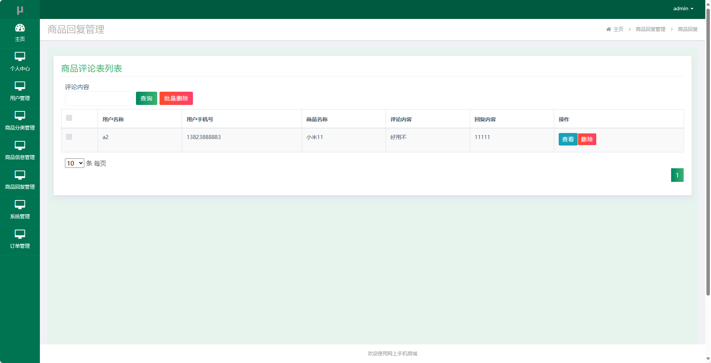

## 基于SSM框架实现的网上手机商城(程序+报告)

###  获取sql数据库文件: 从戎源码网 (https://armycodes.com/) QQ: 386869957 QQ群: 377586148
###  所有系统地址: (https://github.com/YuLin-Coder/AllProjectCatalog) 
###  所有项目以及源代码本人均调试运行无问题 可支持远程安装部署调试、定制修改、代码讲解

## 项目介绍
基于SSM框架实现的网上手机商城，系统包含两种角色：管理员、用户,系统分为前台和后台两大模块，主要功能如下。

前台-【用户】：
1. 首页：展示网站的基本信息和推荐商品，包括热门手机、促销活动等内容，提供快捷入口和搜索功能，方便用户浏览和查找感兴趣的商品。
2. 商品信息：用户可以浏览手机的详细信息，包括商品名称、价格、图片、规格等，还可以查看用户评价和商品的库存情况。
3. 新闻资讯：用户可以浏览最新的手机资讯，包括新品发布、科技动态、市场趋势等内容，方便用户了解最新的手机信息。
4. 跳转到后台：用户可以根据需要跳转到后台管理界面，方便用户进行个人信息管理、收藏管理和订单管理等操作。
5. 购物车：用户可以将感兴趣的商品加入购物车，方便集中管理和下单购买。
6. 我的：用户可以登录或注册账号，查看个人信息和收藏记录，还可以进行订单查询、评价商品等操作，方便用户管理个人信息和交易记录。

后台-【管理员】：
1. 个人中心：管理员可以查看和管理个人信息，包括用户名、手机号码、员工编号等，还可以修改密码和联系方式。
2. 用户管理：管理员可以管理用户信息，包括查看用户列表、编辑用户信息、冻结用户账号等，还可以查看用户的收藏记录和订单。
3. 商品分类管理：管理员可以管理商品分类，包括添加、编辑和删除分类，设置分类的名称和排序，还可以查看分类下的商品和统计数据。
4. 商品信息管理：管理员可以管理商品信息，包括添加、编辑和删除商品，设置商品的名称、价格、规格等，还可以管理商品的库存和上架状态。
5. 商品回复管理：管理员可以管理用户对商品的评价和回复，包括查看评价列表、回复评价、删除评价等，还可以管理评价的审核和统计数据。
6. 系统管理：管理员可以管理系统的基本设置，包括设置网站的名称、LOGO、SEO优化等，还可以配置网站的基本信息和权限控制。
7. 订单管理：管理员可以管理用户的订单，包括查看订单列表、发货、退款等操作，还可以统计订单的销售数据和用户购买情况。

## 项目技术
- 编程语言：Java
- 数据库：MySQL
- 前端技术：JSP、HTML、Jquery、Bootstrap
- 后端技术：Spring、SpringMVC、MyBatis

## 运行环境
- JDK版本：JDK1.8及以上
- 开发工具：IDEA、Ecplise、Myecplise都可以
- 数据库: MySQL5.7及以上

## 运行截图

